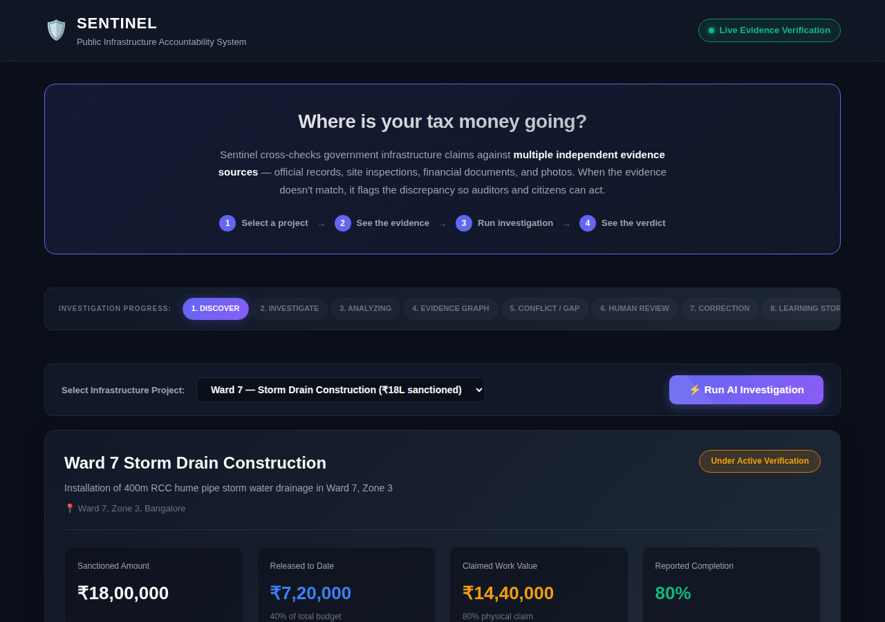
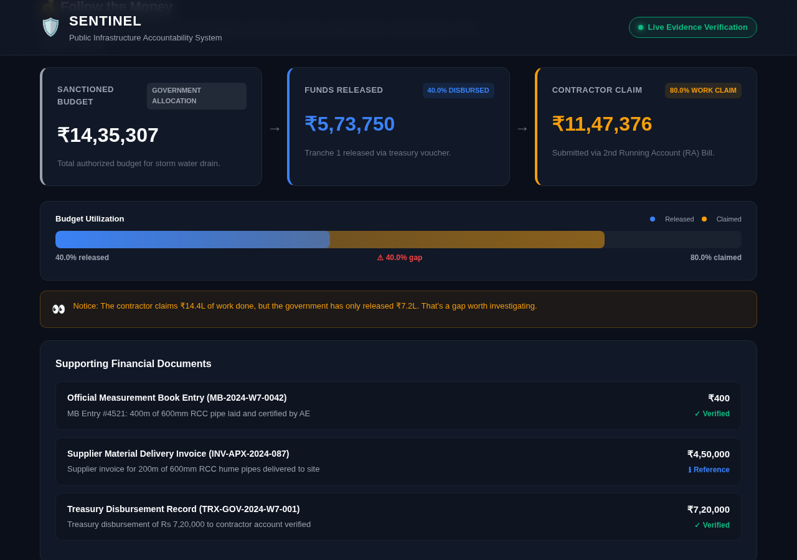
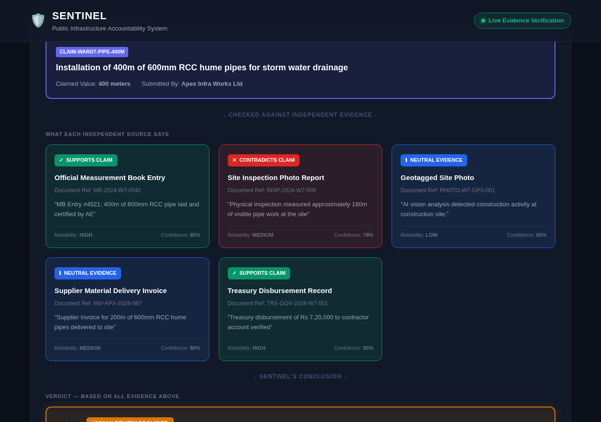
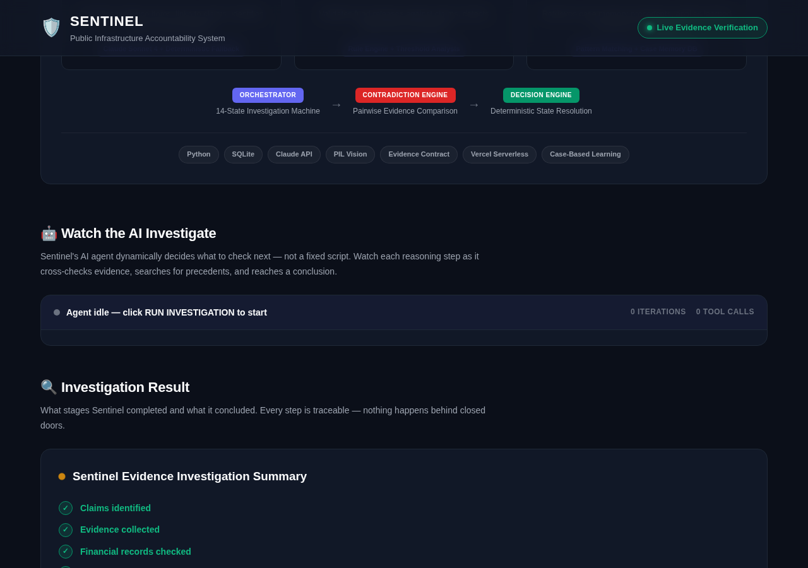
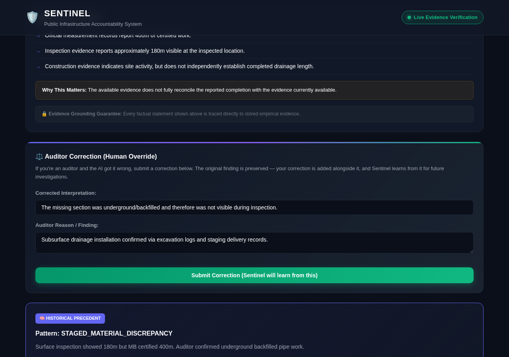

# SENTINEL ✦

**Agentic Evidence Intelligence for Public Infrastructure Accountability**

> *"Sentinel doesn't accuse — it makes it expensive to lie."*

Built by **Team Pegasus** for **Prompthon AI Edition 2026** — Problem Statement #504: Public Fund Utilization Tracker.

---

## The 30-Second Pitch

India spends ₹10+ lakh crore annually on public infrastructure. A contractor claims they laid 400m of drainage pipe. The government certifies it. Money flows. But did anyone actually check?

**Sentinel cross-checks 5 independent evidence sources** — official measurement books, treasury bank records, supplier invoices, geotagged site photos, and physical inspections. When they don't agree, it flags the discrepancy with evidence, not accusations.

One source can lie. Forging five independent sources simultaneously is a conspiracy across multiple institutions — and conspiracies are expensive.

---

## Screenshots

### Verdict Banner & Project Overview

*The one-line punchline: "Contractor claims 400m — only 180m verified. 220m gap identified."*

### Follow the Money

*Track sanctioned budget → funds released → contractor claim. The amber callout flags when numbers don't add up.*

### Evidence Cross-Check

*Each independent source tells its side. Green = supports. Red = contradicts. The cross-check matrix shows which sources disagree.*

### Watch the AI Investigate

*Sentinel's agentic loop dynamically decides what to check next — not a fixed script. Every reasoning step is visible.*

### Plain-Language Explanation & Auditor Override

*Evidence-grounded findings in plain language. Auditors can submit corrections, and Sentinel learns from them.*

---

## Why This Data Already Exists (and Why Nobody Cross-Checks It)

This is the most common question: "Why would the government give you this data?"

**They already do.** Every data source Sentinel uses is publicly available under Indian law:

| Source | Where It Comes From | Legal Basis |
|--------|---------------------|-------------|
| Measurement Book Records | PWD / Municipal Engineering Dept | **RTI Act 2005**, Section 4(1)(b) |
| Treasury Disbursements | PFMS (Public Financial Management System) | Published at **pfms.nic.in** |
| Supplier Invoices & Procurement | GEM (Government e-Marketplace) | Published at **gem.gov.in** (mandatory for orders >₹25K) |
| Geotagged Site Photos | Field inspection protocol | Standard project documentation |
| CAG Audit Reports | Comptroller & Auditor General | Published annually at **cag.gov.in** |
| Citizen Reports | Ward committee observations | **74th Constitutional Amendment** |

The raw data exists across 5+ portals in different formats. No citizen or auditor can manually cross-check an MB record against a bank statement against a site photo against an invoice. **Sentinel's value isn't the data — it's the automated cross-verification.**

---

## Why Trust Sentinel? (Collusion Resistance)

Another key question: "What if everyone colludes? The contractor is friends with the Junior Engineer — why would they use this?"

### The 5-Source Independence Principle

To fool Sentinel, a bad actor would need to simultaneously:

1. **Falsify the MB record** (requires the Junior Engineer at PWD)
2. **Forge treasury bank statements** (requires access to PFMS/state treasury)
3. **Fake supplier invoices** (requires the material supplier to cooperate)
4. **Doctor geotagged photos** (requires spoofing GPS metadata + visual content)
5. **Silence local citizens** (requires no one in the ward to notice)

That's not one bribe — it's a conspiracy across **5 independent institutions** with different incentives, different oversight bodies, and different record-keeping systems.

**Sentinel makes collusion expensive.** Even a contractor-JE friendship can't control what the bank recorded, what the supplier invoiced, or what the GPS-stamped photo shows.

### Trust Architecture

```
Contractor → MB Record (400m certified)     ─┐
Treasury   → Bank Statement (₹7.2L released) │
Supplier   → Invoice (materials for 400m)     ├─→ CROSS-CHECK → Discrepancy flagged
GPS Photo  → Site Image (180m visible)        │
Citizen    → Ward Report (partial work seen)  ─┘
```

If any two sources disagree, Sentinel flags it. The AI finds — **humans decide**.

---

## Path to Sustainability (Revenue Model)

"If it's for citizens, who pays?"

| Model | Who Pays | Why |
|-------|----------|-----|
| **B2G SaaS** (Primary) | Municipal audit departments | CAG mandates infrastructure audits. Currently done manually — Sentinel automates cross-verification. Municipalities pay per-project or annual license to avoid CAG penalties. |
| **NGO & Development Agencies** (Scale) | World Bank, UNDP, CSR funds | Transparency tools are funded under SDG 16 (Strong Institutions). India's CSR mandate (Companies Act §135) requires 2% profit spend. |
| **Media & Investigative Licensing** (Expand) | News organizations | Structured evidence packages on suspect projects — not raw data, but investigation-ready evidence trails with reliability ratings. |

The **primary revenue path** is B2G: the government already pays auditors to do this work manually. Sentinel does it faster, cheaper, and with a paper trail that satisfies CAG compliance.

---

## Architecture

```
                    ┌─────────────────────────────┐
                    │     Citizen Dashboard        │
                    │  Verdict Banner + Evidence   │
                    │  Data Sources + Trust Panel  │
                    └──────────────┬──────────────┘
                                   │ REST API
                                   ▼
                    ┌─────────────────────────────┐
                    │      Sentinel API Layer      │
                    │   (api.py — Role-Based ACL)  │
                    └──────────────┬──────────────┘
                                   │
              ┌────────────────────┼────────────────────┐
              ▼                    ▼                    ▼
   ┌──────────────────┐ ┌──────────────────┐ ┌──────────────────┐
   │   Orchestrator    │ │  Agent Loop      │ │   Validator      │
   │  14-State Machine │ │  Dynamic Planner │ │  Safety Rules    │
   └────────┬─────────┘ └────────┬─────────┘ └──────────────────┘
            │                    │
            ▼                    ▼
   ┌──────────────────────────────────────────┐
   │           6 Investigation Tools          │
   │                                          │
   │  analyze_photo    cross_check_values     │
   │  verify_financial_trail                  │
   │  search_precedents  flag_discrepancy     │
   │  request_human_review                    │
   └────────────────────┬─────────────────────┘
                        │
                        ▼
   ┌──────────────────────────────────────────┐
   │          SQLite + Evidence Contract       │
   │                                          │
   │  Projects │ Claims │ Evidence │ Findings │
   │  Human Corrections │ Case Memory         │
   └──────────────────────────────────────────┘
```

### Key Design Decisions

- **14-State Investigation Machine** (`orchestrator.py`): Deterministic state transitions ensure investigations follow auditable paths. LLMs reason over evidence but cannot skip states or bypass human review.

- **Agentic Investigation Loop** (`agent_loop.py`): A dynamic planner (`_decide_next_action`) chooses which tool to call next based on what's been found so far — not a fixed pipeline. Supports Claude API mode and a deterministic fallback.

- **Evidence Contract** (`types.py`): Every evidence item conforms to a universal interface with `source_type`, `value`, `unit`, `confidence`, `reliability`, and `relationship` fields. This makes cross-source comparison possible regardless of origin.

- **PIL Computer Vision** (`vision/`): Analyzes geotagged site photos using edge detection (ImageFilter.FIND_EDGES), color statistics (ImageStat), and construction activity classification. No cloud vision API required.

- **Non-Accusatory Safety Design** (`validator.py`): Sentinel flags discrepancies, never accuses. Forbidden terms are enforced at the output layer. Uncertainty = "INSUFFICIENT_EVIDENCE", never "CONTRADICTED".

- **Case Memory / Institutional Learning** (`db.py`): Auditor corrections are stored as structured precedents. Future investigations retrieve relevant precedents to avoid repeating the same error.

- **Dual-Mode Execution**: Claude API for full agentic reasoning when available; deterministic fallback (pairwise evidence comparison, rule-based decisions) when it's not.

### Investigation States

```
CREATED → INTAKE → CLAIMS_IDENTIFIED → EVIDENCE_COLLECTION → CROSS_CHECK
→ CONFLICT_ANALYSIS → DECISION → { SUPPORTED | CONTRADICTED | INSUFFICIENT_EVIDENCE }
→ HUMAN_REVIEW_REQUIRED → CORRECTION_APPLIED → LEARNING_STORED → CLOSED
```

---

## Tech Stack

| Layer | Technology |
|-------|------------|
| **Backend** | Python 3.11, SQLite |
| **AI** | Claude Sonnet 4 API (agentic loop) + deterministic fallback |
| **Vision** | PIL/Pillow (edge density, brightness, color stats, activity detection) |
| **Frontend** | Vanilla HTML/CSS/JS (Pegasus constellation theme) |
| **Deployment** | Vercel Serverless Functions |
| **Testing** | pytest (134 tests across all modules) |

---

## Project Structure

```
sentinel/
├── src/sentinel/
│   ├── agent_loop.py           # Agentic investigation with dynamic planner
│   ├── api.py                  # REST API with role-based access control
│   ├── claude_client.py        # Claude API integration
│   ├── db.py                   # SQLite database + case memory storage
│   ├── orchestrator.py         # 14-state investigation state machine
│   ├── types.py                # Evidence Contract (universal data types)
│   ├── validator.py            # Safety rules + forbidden term enforcement
│   ├── agents/                 # Specialized investigation agents
│   │   ├── intake_agent.py     # Evidence intake & classification
│   │   ├── financial_agent.py  # Financial cross-check
│   │   └── historical_agent.py # Case memory precedent retrieval
│   ├── engines/                # Core analysis engines
│   │   ├── contradiction_engine.py    # Pairwise evidence comparison
│   │   ├── decision_engine.py         # Deterministic state resolution
│   │   ├── case_memory_engine.py      # Precedent matching
│   │   └── spatial_temporal_engine.py # Location/time analysis
│   └── vision/                 # Computer vision pipeline
│       ├── adapter.py          # Photo → Evidence conversion
│       ├── evaluator.py        # Vision quality assessment
│       ├── construction_adapter.py # Construction-specific analysis
│       ├── taxonomy.py         # Construction activity taxonomy
│       └── event_interpreter.py # Visual event detection
├── public/
│   ├── index.html              # Citizen dashboard (Pegasus constellation theme)
│   ├── styles.css              # Deep space UI with glassmorphism
│   └── app.js                  # Frontend logic + star field animation
├── api/
│   └── index.py                # Vercel serverless entry point
├── tests/                      # 134 tests across 16 test files
├── data/vision_eval/           # Vision evaluation sample images
├── docs/                       # Architecture, product spec, state machine docs
├── supabase/                   # Database migrations & seed data
└── vercel.json                 # Deployment config
```

**Codebase**: ~11,000 lines (4,100 Python backend + 3,800 frontend + 3,100 tests)

---

## Use Cases

### 1. Citizen Oversight
A resident in Ward 7 sees that ₹18L was sanctioned for storm drain construction. The dashboard shows only ₹7.2L was released but the contractor claims ₹14.4L of work done. The evidence graph reveals that physical inspection found only 180m of the claimed 400m. The citizen now has documented evidence to file an RTI or raise the issue at a ward meeting.

### 2. Auditor Investigation
A government auditor runs an AI investigation on a flagged project. Sentinel's agent cross-checks MB records against site photos, compares invoice quantities with delivery records, and flags a 55% discrepancy between certified and visible work. The auditor reviews, realizes the pipe work is underground (backfilled), submits a correction with excavation log evidence. Sentinel stores this as case memory — next time it encounters subsurface infrastructure, it checks backfilling logs first.

### 3. Pattern Detection Across Projects
After processing multiple ward projects, Sentinel's case memory accumulates patterns: "STAGED_MATERIAL_DISCREPANCY" (materials delivered but not installed), "SUBSURFACE_INFRASTRUCTURE" (underground work invisible to surface inspection), "SPLIT_INVOICE_INFLATION" (multiple invoices for one delivery). Future investigations automatically surface relevant precedents.

### 4. Collusion Resistance
Even if a contractor and Junior Engineer collude to fake MB records, Sentinel cross-checks against independent sources they can't easily control: bank statements (treasury records), geotagged photos (GPS metadata), supplier invoices (third-party), and physical inspections (separate agency). Forging all sources simultaneously requires compromising multiple independent institutions.

---

## Evidence Trustworthiness

Every evidence item carries two scores:

- **Reliability** (HIGH / MEDIUM / LOW): Based on source type. Treasury bank records = HIGH (government-controlled, hard to fake). Physical inspection = MEDIUM (human observer, limited visibility). Geotagged photos = LOW (can be manipulated, limited context).

- **Confidence** (0.0 - 1.0): How precisely this evidence speaks to the specific claim. A bank statement confirming exact disbursement = 0.95. A photo showing "construction activity" without measuring meters = 0.65.

Sentinel never trusts a single source. The evidence graph shows all sources side-by-side, their reliability, and whether they agree or conflict. The verdict comes from weighted cross-comparison, not any single input.

---

## Safety & Ethics

- **Never accuses**: Sentinel flags discrepancies, not fraud. Accusation is a human legal decision.
- **Uncertainty is preserved**: Missing data = "INSUFFICIENT_EVIDENCE", never "CONTRADICTED".
- **Human override is first-class**: Auditor corrections are stored alongside original findings, creating a transparent audit trail.
- **No silent hallucination**: Every factual statement in the explanation is traced to a stored evidence item.
- **Append-only evidence**: Raw evidence rows are never modified. Corrections are added as new records.
- **Non-accusatory language**: Forbidden terms ("fraud", "corrupt", "stealing") enforced at the output layer.

---

## Quick Start

```bash
# Clone
git clone https://github.com/laknanitish2110-sudo/Sentinel.git
cd Sentinel

# Install dependencies
pip install -r requirements.txt

# Run tests (134 tests)
python -m pytest tests/ -v

# Start local demo server
python scripts/start_server.py
```

---

## Panel Q&A Reference

| Question | Answer |
|----------|--------|
| "Why would the government give you this data?" | They already do — RTI Act 2005, PFMS, GEM portal, CAG reports. All legally mandated for disclosure. |
| "If data already exists, what's the point?" | Raw data is scattered across 5+ portals. No one cross-checks MB records against bank statements against site photos. Sentinel automates cross-verification. |
| "What if everyone colludes?" | Collusion across 5 independent institutions (PWD, Treasury, Supplier, GPS, Citizens) is exponentially harder than faking one record. |
| "Is this a product or service?" | B2G SaaS for municipal audit departments. CAG mandates audits — Sentinel automates what's currently manual. |
| "Who pays?" | Municipalities (compliance), NGOs/World Bank (SDG 16 funding), media (evidence packages). |
| "What's the core solution?" | Cross-verification of independent sources. One source can lie. Five lying in coordination is a conspiracy. |
| "How does the AI work?" | Agentic loop with dynamic planning — AI decides what to check next, not a fixed script. 14-state machine ensures auditability. |
| "What if the AI is wrong?" | Auditor corrections are preserved. Sentinel learns from them. The original finding is never overwritten. |

---

**Built by Team Pegasus ✦** | Prompthon AI Edition 2026 | PS #504

MIT License
